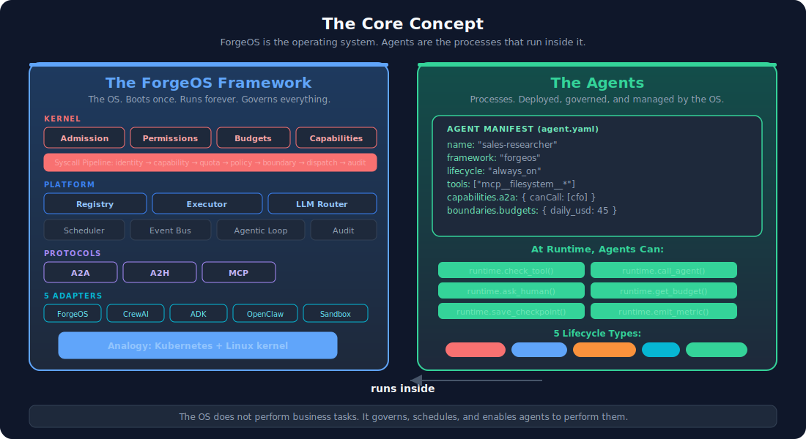
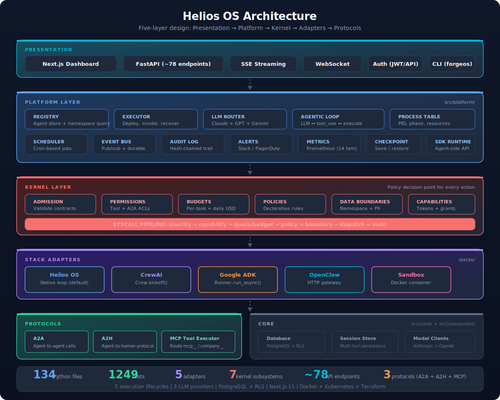

# Architecture Overview



## The Core Distinction: Framework vs Agents

Helios OS has two halves that must not be confused:

**The Helios OS Framework** is the infrastructure layer. It is the operating system. It boots once, runs continuously, and provides services to everything inside it. The framework does not perform business tasks -- it enables agents to perform them.

**Agents** are the AI workloads that run inside the framework. Each agent has a name, a system prompt, a set of tools, and an execution lifecycle. Agents perform the actual work: sending emails, scoring leads, generating reports, answering questions.

### The Container Analogy

| Concept | Traditional Infrastructure | Helios OS |
|---------|--------------------------|---------|
| **The platform** | Kubernetes | Helios OS framework |
| **The workloads** | Pods/containers | Agents |
| **Scheduling** | CronJobs, Deployments | SchedulerEngine (cron), EventBus (pub/sub) |
| **Networking** | Services, Ingress | EventBus (cross-agent messaging) |
| **Storage** | PersistentVolumes | Session store, knowledge base |
| **Monitoring** | Prometheus, Grafana | AuditLog, Metrics, AlertDispatcher |
| **Runtime** | containerd, CRI-O | Stack adapters (Helios OS, CrewAI, ADK, OpenClaw) |
| **Registry** | Container registry | AgentRegistry |

Just as Kubernetes does not care whether a container runs nginx or PostgreSQL, Helios OS does not care whether an agent scores leads or drafts emails. The framework provides the lifecycle; agents provide the behavior.

---



## Three-Layer Architecture

Helios OS is built in three layers. Each layer has a clear responsibility, and the boundaries are enforced by Python package structure:

```
stacks/            <-- Layer 1: Stack Adapters (the runtimes)
src/platform/      <-- Layer 2: Platform Layer (the orchestration)
src/core/ + src/companies/   <-- Layer 3: Core + Companies (the foundation)
```

### Layer 1: Stack Adapters (`stacks/`)

**What they do:** Provide different agent runtimes. Each adapter wraps a different AI framework behind a common interface (`AgentStackAdapter`).

**Why they exist:** Different agent frameworks have different strengths. CrewAI excels at multi-role collaboration. Google ADK integrates with the Google ecosystem. OpenClaw uses a markdown-first approach. Helios OS native is the simplest and most flexible. Rather than choosing one, Helios OS supports all four and lets each agent pick the best fit.

**The interface** (from `stacks/base.py`):

```python
class AgentStackAdapter(ABC):
    async def create_agent(self, agent_def: AgentDefinition) -> str
    async def invoke(self, agent_id: str, prompt: str, ...) -> AgentResult
    async def start_loop(self, agent_id: str) -> None
    async def stop(self, agent_id: str) -> None
    def get_status(self, agent_id: str) -> AgentStatus
    def scaffold_files(self, agent_def: AgentDefinition) -> dict[str, str]
```

Every adapter implements this interface. The platform layer calls these methods without knowing which adapter it's talking to.

**Fallback pattern:** When a framework SDK is not installed (e.g., `crewai` package missing), the adapter automatically falls back to the Helios OS native agentic loop. This means every agent works out of the box -- the SDK just provides enhanced capabilities.

### Layer 2: Platform Layer (`src/platform/`)

**What it does:** Orchestrates agents regardless of which stack they use. Provides the shared services that make agents useful.

| Component | File | Purpose |
|-----------|------|---------|
| **AgentRegistry** | `registry.py` | Universal agent store. Query by stack, type, owner, department. PostgreSQL-backed or in-memory. |
| **PlatformExecutor** | `executor.py` | Central dispatcher. Deploys agents (register -> scaffold -> create -> wire lifecycle). Invokes agents (route to adapter -> agentic loop). Manages recovery after crashes. |
| **SchedulerEngine** | `scheduler.py` | Cron-based scheduling for `scheduled` agents. Uses APScheduler when available. |
| **EventBus** | `event_bus.py` | Pub/sub messaging for `event_driven` agents. Enables cross-department communication. |
| **LLMRouter** | `llm_router.py` | Routes LLM calls to Anthropic or OpenAI based on model prefix. 3-attempt retry with exponential backoff. Provider failover. Streaming support. |
| **Agentic Loop** | `agentic_loop.py` | The core loop: send messages to LLM -> if LLM requests tools, execute them -> send results back -> repeat until LLM stops. Both synchronous and streaming (SSE) variants. |
| **AuditLog** | `audit.py` | Records every significant platform event with timestamps and context. |
| **AlertDispatcher** | `alerts.py` | Fires alerts to Slack, PagerDuty, or logs when critical events occur (failover, crash loop, cost exceeded). |
| **Metrics** | `metrics.py` | Prometheus metrics: 14 families covering agents, LLM calls, tool execution, scheduling, approvals, and cost. |

### Layer 3: Core + Companies (`src/core/`, `src/companies/`)

**What it does:** Provides the foundational infrastructure (database, hooks, sessions) and the business logic for each company package.

**Core** (`src/core/`):
- `database.py` -- Multi-tenant PostgreSQL with Row-Level Security. `tenant()` sets session context. Falls back to in-memory.
- `hooks.py` -- Seven-check governance chain: budget -> rate limit -> auth -> cost -> compliance -> notification -> audit.
- `session_store.py` -- Conversation persistence across agent invocations.
- `migrations.py` -- SQL migration runner that scans `infrastructure/database/`.

**MCP Tools** — the tool-execution layer is now a standalone package, [`forgeos-mcp`](https://github.com/antonibergas-hue/forgeos-mcp) (`forgeos_mcp.integration`, formerly `src/mcp/`), co-installed with the platform:
- `tool_executor.py` -- Routes tool calls: `mcp__*` to MCP servers, `company__*` to in-process handlers. Enforces per-agent tool whitelists.
- `server_manager.py` -- MCP server lifecycle: read config, spawn stdio processes, discover tools via `list_tools()`, disconnect.
- `client_mcp_manager.py` -- Per-client MCP connections with LRU eviction and TTL. Enables multi-tenant tool isolation.

**Companies** (`src/companies/<id>/`):
- Each company package provides agent definitions, workflows, knowledge base entries, config YAML, and a demo script.
- Five implementations: LeadForge (B2B sales), DealForge (M&A), TravelForge (travel), InsureForge (insurance), HomeForge (real estate).

---


## How an Agent Runs (End to End)

Here is the complete lifecycle of an agent, from deployment to invocation:

### 1. Deployment

```
User sends POST /api/platform/agents with:
  { name: "daily-report", stack: "forgeos", execution_type: "scheduled", schedule: "0 9 * * *", ... }

  -> FastAPI handler creates AgentDefinition
  -> executor.deploy(agent_def)
     -> Validate name (regex, no path traversal)
     -> Check uniqueness in registry
     -> Register in database (or in-memory)
     -> Scaffold files to agents/{shared|personal}/{name}/
     -> adapter.create_agent(agent_def)  [stack-specific initialization]
     -> _wire_execution(agent_def)       [set up lifecycle]
        -> For SCHEDULED: scheduler.add_job(agent_id, cron, callback)
        -> For ALWAYS_ON: adapter.start_loop(agent_id)
        -> For EVENT_DRIVEN: event_bus.subscribe(trigger, agent_id, callback)
        -> For REFLEX: set status to IDLE (waits for manual invoke)
        -> For AUTONOMOUS: create asyncio task running goal-directed loop
```

### 2. Invocation

```
User sends POST /api/platform/agents/{id}/invoke with:
  { prompt: "Generate the daily report for 2026-04-12" }

  -> executor.invoke(agent_id, prompt)
     -> Load agent_def from registry
     -> Load conversation history from session store (if session_id provided)
     -> adapter.invoke(agent_id, prompt, context, history)
        -> Build tool definitions from tool_executor
        -> Build system prompt from agent_def
        -> run_agentic_loop(llm_router, llm_config, system, prompt, tools, ...)
           -> LOOP:
              -> llm_router.chat(config, messages, tools)   [call the LLM]
              -> If LLM returns tool_use blocks:
                 -> For each tool: tool_executor.execute(name, input, context)
                    -> Route: mcp__* -> MCP server | company__* -> in-process handler
                 -> Append tool results to messages
                 -> Continue loop
              -> If LLM returns end_turn:
                 -> Return AgentResult(output=text, tool_calls=[...], tokens_used=N)
     -> Save conversation to session store
     -> Return result
```

### 3. Streaming Chat

The streaming variant (`POST /api/platform/agents/{id}/chat/stream`) uses `run_agentic_loop_with_events()` which yields SSE events as they happen:

```
text_delta   -> Partial text from the LLM
tool_call    -> Agent is calling a tool
tool_result  -> Tool execution completed
hitl_request -> Agent requested human approval
done         -> Invocation complete
error        -> Something went wrong
```

---

## Agent Definition Schema

Every agent is defined by `AgentDefinition` (from `stacks/base.py`):

| Field | Type | Description |
|-------|------|-------------|
| `name` | str | Unique agent name (2-64 chars, alphanumeric + hyphens) |
| `stack` | str | Runtime: `forgeos`, `crewai`, `adk`, `openclaw` |
| `execution_type` | ExecutionType | `always_on`, `scheduled`, `event_driven`, `reflex`, `autonomous` |
| `ownership` | OwnershipType | `personal`, `shared`, `client` |
| `agent_id` | str | Auto-generated UUID (first 12 chars) |
| `owner_id` | str | User or client ID for scoping |
| `llm_config` | LLMConfig | Chat model, reasoning model, provider |
| `schedule` | str | Cron expression (for `scheduled` type) |
| `event_triggers` | list[str] | Event names to subscribe to (for `event_driven`) |
| `goal` | str | Objective (for `autonomous` type) |
| `tools` | list[str] | Tool names the agent can use (whitelist) |
| `system_prompt` | str | The agent's instructions |
| `description` | str | Human-readable description |
| `department` | str | Organizational grouping |
| `metadata` | dict | Arbitrary config (e.g., `restart_on_failure`, `max_iterations`) |

---


## Boot Sequence

When Helios OS starts (`python -m src.bootstrap`), this happens in order:

1. **Load .env** -- API keys, DATABASE_URL, REDIS_URL
2. **Initialize LLM Router** -- Detect available providers (Anthropic, OpenAI)
3. **Connect database** -- PostgreSQL or fall back to in-memory
4. **Run migrations** -- Apply SQL files from `infrastructure/database/`
5. **Initialize CompanySystem** -- Event bus, HITL gateway, knowledge base, metrics
6. **Connect MCP servers** -- Spawn stdio processes, discover tools (30s timeout)
7. **Create ToolExecutor** -- Register MCP tools + custom tools + platform tools
8. **Wire UsageEnforcer** -- Token/cost tracking per tenant
9. **Register stack adapters** -- Helios OS, CrewAI, ADK, OpenClaw
10. **Build PlatformExecutor** -- Connect registry, scheduler, event bus
11. **Recover agents** -- Load from DB, re-wire execution lifecycles
12. **Create tenant** -- Ensure default tenant exists (FK constraints)
13. **Seed data** -- Knowledge base + sample HITL approvals
14. **Start scheduler** -- Begin cron job execution
15. **Start API server** -- FastAPI on uvicorn (background thread)

The entire boot is wrapped in try/except with stage-tracked cleanup.
